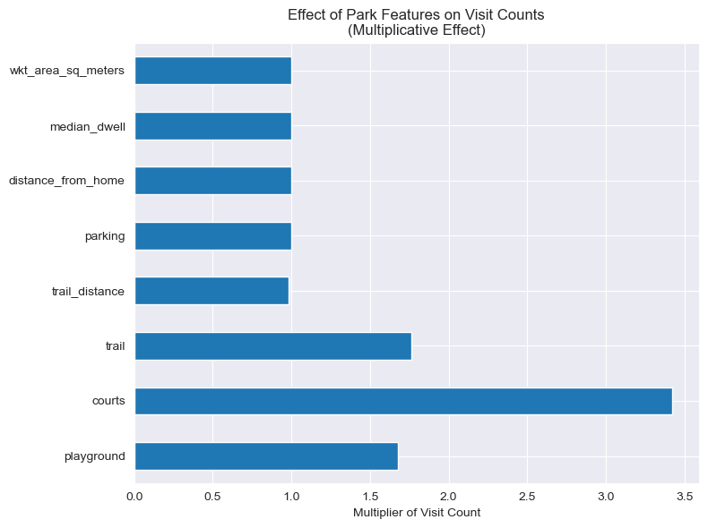

## Background

Urban green spaces are vital for community well-being. Traditional models for assessing environmental equity often use fixed-distance measures, like the distance from a residence to a park. These models do not consider how people actually use these spaces. New technology, such as crowdsourced GPS tracking and POI data, gives better insights into community mobility, though the data can be inconsistent. The goal of this project was to build a reliable process to extract, classify, and analyze how green space is actually used in Athens, Georgia. This helps us understand who uses these spaces and how often.

## Methodology

I developed a comprehensive data ingestion and spatial processing pipeline to handle unstructured POI and mobility data.

* I built the architecture in Python, using `pandas` for data wrangling, `scikit-learn` for modeling, and `geopandas` with `shapely` for geometry.
* The raw dataset needed major algorithmic filtering. I built a system to classify and isolate specific environmental amenities, such as Nature Parks, Zoos, and Botanical Gardens. I also manually removed algorithmic noise, like commercial pools and Homeowner Association lots.
* To connect tabular big data with GIS systems, I built a translator. It parsed Well-Known Text (WKT) footprint strings from the POI dataset into coordinate-referenced multi-polygons. I then exported these as GeoPackages (`.gpkg`) for validation in ArcGIS against OpenStreetMap infrastructure.

## Interactive Visualization

I created an interactive map using `folium` that allows you to explore park clusters, park usage, and how park boundaries are defined.

<iframe src="interactive_map.html" width="100%" height="600px" style="border:1px solid #ddd; border-radius: 8px;"></iframe>

## Results

The processed data allows measuring metrics such as average visits per person and average time spent per visit in parks.

The analysis shows that total park area matters, but specific amenities, like playgrounds and picnic areas, drive more people to use green spaces. Looking across park clusters, such as Sandy Creek Park and Boulevard Woods, the project identified unusual usage patterns that static census models would not detect.

## Conclusion

This project demonstrates how data engineering can bridge the gap between theoretical and empirical models of environmental equity. By converting complex mobility data into actionable measures of green space utilization, the work builds on detailed analysis of amenities, statistical outliers, and spatial clusters identified throughout Athens, Georgia. These advances connect usage patterns to real equity concerns, delivering clearer evidence for researchers and policymakers to address urban environmental equity effectively.
