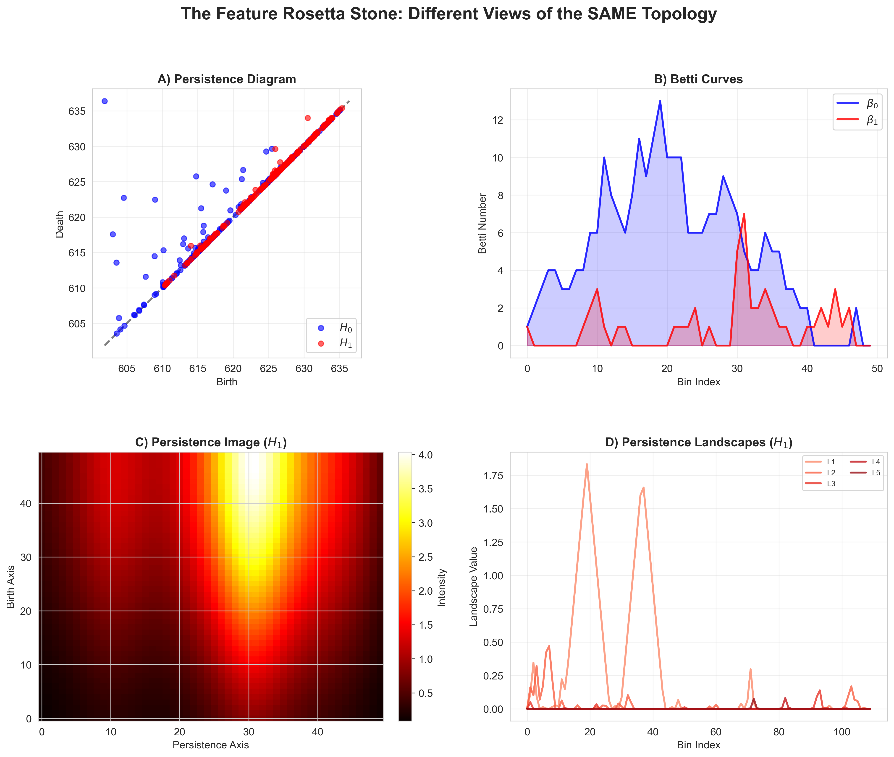
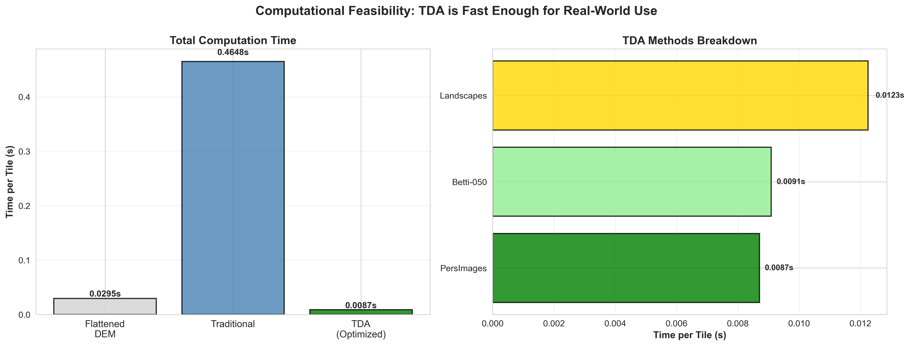

## Background

Karst landscapes, such as the Mammoth Cave system in Kentucky, present a unique geomorphological challenge. Their defining features (sinkholes, complex drainage networks, and subterranean voids) are highly topological in nature. Traditional geomorphometry relies on multi-scale derivative calculations (e.g., slope, aspect, TWI) that are computationally intensive and difficult to scale. Conversely, modern deep learning vision models are powerful but relatively opaque feature extractors. This project investigated whether topological data analysis (TDA) could serve as a mathematically interpretable, computationally efficient alternative to extract multiscale spatial features from digital elevation models (DEMs).

## Methodology

A feature extraction and evaluation pipeline was developed to process over 30,000 DEM tiles, enabling a comparative analysis of traditional geomorphometric features, pre-trained vision models (ResNet), and TDA-derived attributes.

* Pipeline implementation was conducted in Python, integrating giotto-tda for topological computations, WhiteboxTools for terrain-derivative generation, and scikit-learn for machine-learning classification.
* To maintain mathematical validity, persistent homology was excluded from circular variables (e.g., aspect) and aggregate statistical descriptors (e.g., texture). TDA was strictly applied to elevation and slope derivatives. Terrain topology was encoded using Betti curves to form stable vector representations.
* Model performance was assessed using F1-macro scores, leveraging both random and spatially constrained 5-fold cross-validation to evaluate geographic generalization. 

To visualize the semantic alignment between these vastly different approaches, we map how each method interprets the same discrete piece of terrain (**Figure 1**).

## Results

Rigorous equivalence testing was conducted using Two One-Sided Tests (TOST), with Bonferroni correction applied ($\alpha=0.000714$) to rigorously control for type I error.

The empirical evidence revealed that while pure TDA was efficient (**Figure 2**), it underperforms traditional geomorphometry as a standalone classifier (F1: 0.606 vs. 0.731). The statistical testing identified three robust hybrid methods, each combining various traditional geomorphometry features (e.g., slope, aspect, TWI) with topological Betti feature representations from TDA. Specifically, a Multi-scale (traditional spatial derivatives) + Betti (TDA-based) feature union achieved practical predictive equivalence (F1: 0.663 in spatial CV) compared to the best traditional baseline.

## Conclusion

These results demonstrate that topological features are highly efficient, low-dimensional supplements to classical spatial statistics. Consequently, TDA is best employed alongside, rather than as a substitute for, physics-driven geomorphological derivatives.
