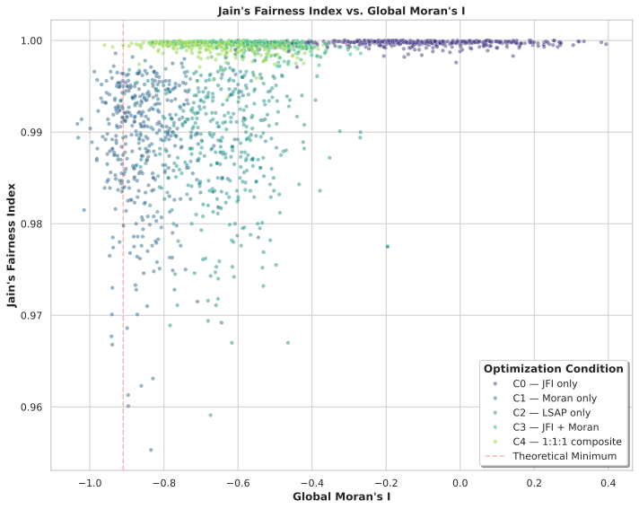

## Background

In spatial resource distribution, there is a fundamental tension between optimizing for systemic equity and controlling for spatial clustering. Using the combinatorial map generation of the game Twilight Imperium IV as a discrete search domain, this project investigates the mathematical pathology that occurs when scalar equity metrics are optimized without regard for local topological structures. The objective was to evaluate whether systemic bottleneck fairness and geographic dispersion are mutually exclusive.

## Methodology

I built a custom Python optimization engine to traverse the highly constrained discrete state-space of map topologies, leveraging object-oriented metaheuristics.

* The architecture leverages custom metaheuristic frameworks implemented from scratch.
* I implemented and benchmarked several search algorithms, including Simulated Annealing (SA), NSGA-II, and Tabu Search. SA was selected as the primary solver for the study due to its superior convergence on this specific discrete landscape across 500,000-evaluation budgets.
* The model evaluates a 1:1:1 composite objective, forcing the algorithms to simultaneously balance Jain’s Fairness Index (JFI) for baseline equity, Global Moran’s I for systemic dispersion, and a Local Spatial Autocorrelation Proxy (LSAP) to penalize unnatural clustering.

## Results

A computational study comprising five ablation conditions across 100 paired seeds revealed that scalar fairness alone fails to capture neighborhood patterns. When optimizing strictly for global dispersion without a local penalty, a pathological local clustering effect emerged, which was a problem entirely absent in random or purely fairness-optimized maps.

At first glance, it seems paradoxical that a solver juggling three competing objectives (the full C4 composite) achieves tighter, more consistent convergence than algorithms solving for a single metric. However, the data reveals a fundamental property of the optimization landscape: structural constraints act as mathematical regularizers.

Naive, single-objective searches are highly seed-dependent and fragile, easily trapping the solver in deep local minima. By introducing Moran’s I and LSAP penalties, the algorithm is mathematically forced away from these pits and into smoother, dispersed regions of the space. This regularization dramatically reduces the entropy of the search, yielding a highly robust, tightly clustered optimal result regardless of the initial random seed.

## Conclusion

This work extends Anselin’s global-local (LISA) distinction into the realm of combinatorial optimization. The empirical evidence demonstrates that spatial metrics provide vital structural information beyond standard scalar fairness constraints. By formalizing the domain's spatial rules, the project demonstrates that systemic equity and geographic dispersion can be harmonized.